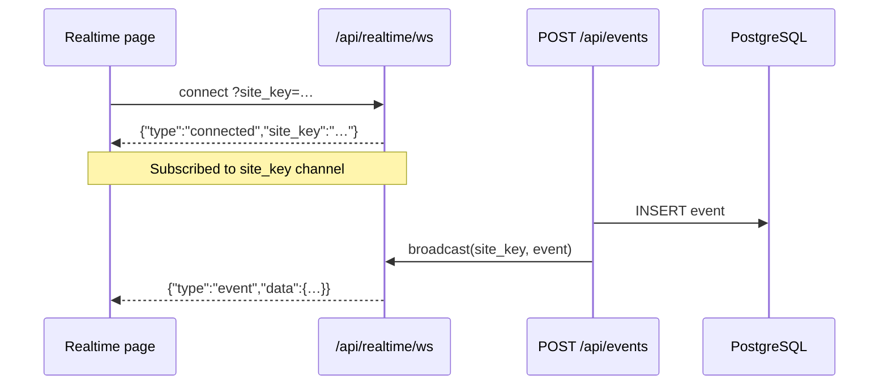

# Realtime WebSocket

Open Analytics pushes new tracking events to connected dashboard clients over WebSocket so the Realtime page updates without polling Supabase.

## Endpoint

```
ws://<host>/api/realtime/ws?site_key=<SITE_KEY>
```

Production example (HTTPS):

```
wss://analytics.example.com/api/realtime/ws?site_key=abc123def456
```

| Query param | Required | Description |
|-------------|----------|-------------|
| `site_key`  | Yes      | Site key from **Projects** (same value as `data-site-key` in the tracker embed). |

The custom Node server (`server.mjs`) handles WebSocket upgrades on this path. Run the app with `npm run dev` or `npm start` (not plain `next dev` / `next start`) so the socket is available.

## Connection flow



1. Client opens WebSocket with the site's `site_key`.
2. Server responds with a `connected` message.
3. When `POST /api/events` inserts an event, the server broadcasts an `event` message to all sockets subscribed to that `site_key`.
4. Client merges the event into its local list (same shape as `AnalyticsEvent` from the REST API).

## Message format

### Server → client: connected

```json
{
  "type": "connected",
  "site_key": "abc123def456"
}
```

### Server → client: new event

```json
{
  "type": "event",
  "data": {
    "id": 12345,
    "site_key": "abc123def456",
    "visitor_id": "…",
    "session_id": "…",
    "event_type": 1,
    "path": "/",
    "created_at": "2026-06-06T12:00:00.000Z"
  }
}
```

The `data` object matches rows returned by `GET /api/sites/[siteId]/events`.

## Client example

```javascript
const siteKey = "abc123def456";
const protocol = location.protocol === "https:" ? "wss:" : "ws:";
const ws = new WebSocket(
  `${protocol}//${location.host}/api/realtime/ws?site_key=${encodeURIComponent(siteKey)}`
);

ws.onmessage = (ev) => {
  const msg = JSON.parse(ev.data);
  if (msg.type === "event") {
    console.log("New visit:", msg.data);
  }
};
```

The dashboard uses `useRealtimeSocket` (`src/hooks/useRealtimeSocket.ts`) with automatic reconnect and polling fallback.

## Security notes

- **Public share pages** (`/share/[siteId]/realtime`) only work when the owner enabled sharing; the page still uses `site_key` for the socket (rendered server-side from the project row).
- Anyone who knows a valid `site_key` can subscribe to live events for that site. Treat `site_key` like a read-only API token.
- Event **writes** go through `POST /api/events` with rate limiting, payload validation, and domain checks — not through the WebSocket.

## Fallback

If the WebSocket disconnects, the Realtime UI polls `GET /api/sites/[siteId]/events?since=…` every 12 seconds until the socket reconnects.
